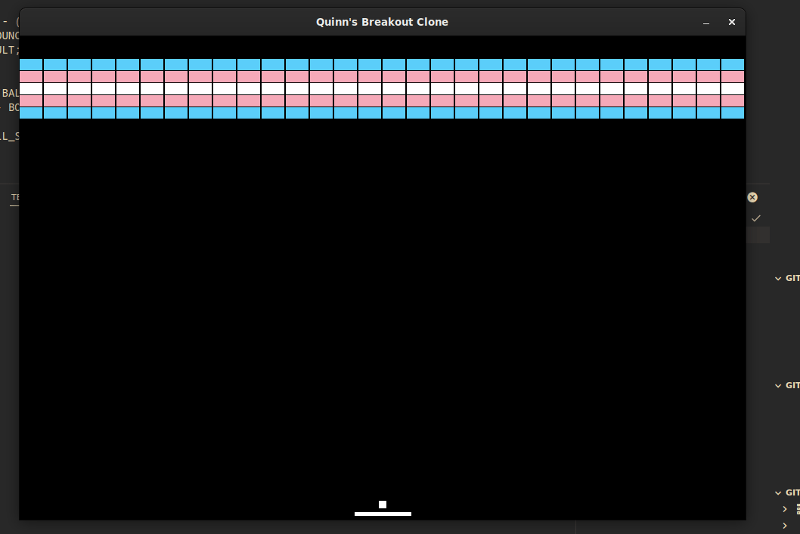

## Breakout Clone
I wanted a project to learn C and the SDL framework in, and settled upon this game as I thought it was a simple and approachable project for me to execute.

### TODO:
- make beeping sound effects
- make the game freeze when you lost instead of closing
- fix constants in level colision detection

